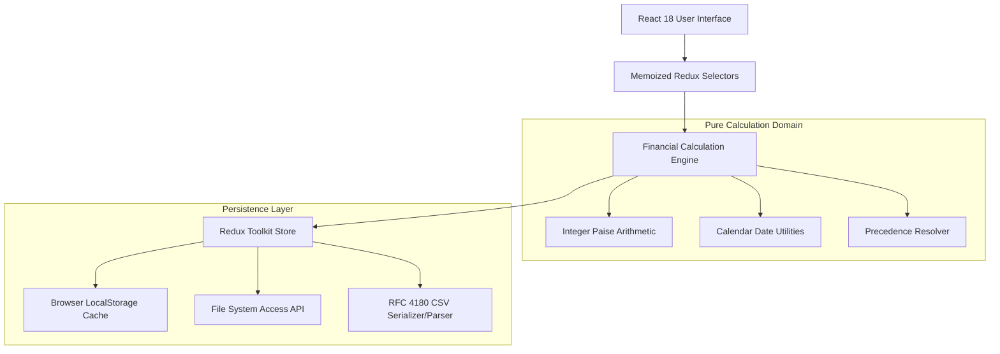

# System Architecture & Design Specification

## Overview

The Loan Tracking & Prepayment Analytics application is designed as a **local-first, deterministic, client-side financial software architecture**. It avoids external server dependencies, cloud synchronization, and server databases, prioritizing calculation correctness, user privacy, and complete client-side data ownership.

---

## 1. Architectural Separation of Concerns

The codebase is partitioned into distinct layers:

1. **Domain Layer (`src/domain/loan/`)**:
   - Pure, deterministic calculation functions without React or Redux dependencies.
   - Authoritative calculation contract versioning (`FCC_VERSION = 1.0`).
   - Integer paise representation and `HALF_UP` rounding.
   - Event generation and amortization schedule modeling.

2. **State Management (`src/app/`, `src/features/`)**:
   - Redux Toolkit is the primary single source of truth for **user-editable source data** (Loans, Events, Rules, Overrides, Scenarios).
   - **No Cached Financial Truth**: Derived analytics (total interest saved, remaining tenure, closing dates) are never stored as independent editable Redux state. They are derived via memoized selectors (`createSelector`), preventing stale or conflicting financial figures.

3. **Services (`src/services/`)**:
   - `csv/`: Serializes and parses versioned CSV data with RFC 4180 multi-line, quote, and comma escaping.
   - `filesystem/`: Connects to the browser's File System Access API (`showOpenFilePicker`, `showSaveFilePicker`) with graceful fallback to browser download/upload.
   - `persistence/`: Manages debounced local-storage caching for page reload recovery.

4. **Component Hierarchy (`src/components/`, `src/pages/`)**:
   - Presentation components never perform complex financial calculations.
   - Reusable UI primitives (`Button`, `Card`, `MetricCard`, `MoneyInput`, `DateInput`, `Dialog`).
   - Recharts visualizations receive precomputed projection series.

---

## 2. Source State vs Derived State

| Entity | Storage Type | Source of Truth |
| :--- | :--- | :--- |
| Loan Parameters (Principal, Rate, Tenure, Dates) | Redux Store | `loansSlice` |
| Actual / Planned Payment Records | Redux Store | `paymentSlice` |
| Recurring Part-Payment Rules | Redux Store | `partPaymentSlice` |
| Individual Month Overrides | Redux Store | `partPaymentSlice` |
| Scenarios | Redux Store | `scenariosSlice` |
| Amortization Schedule | Derived | `selectActiveSchedule` |
| Baseline Comparison Schedule | Derived | `selectActiveBaselineSchedule` |
| Loan KPIs (Current Balance, Interest Paid, Savings) | Derived | `selectActiveKpis` |
| Upcoming Payment Installments | Derived | `selectUpcomingPayments` |
| Scenario Results & Comparison Metrics | Derived | `selectScenarioResults` |

---

## 3. Financial Event Pipeline

Amortization schedule generation follows this sequential pipeline for each month:

1. **Opening Balance Determination**: Starts from previous closing balance or adjusted broken-period principal.
2. **Interest Calculation**: Computed on opening balance using the monthly nominal rate:
   $$r = \frac{\text{annualRate}}{12 \times 100}$$
   $$\text{Interest} = \text{roundHalfUp}(\text{Opening Balance} \times r)$$
3. **Scheduled EMI Application**: Standard formula or recalculated EMI under `REDUCE_EMI` mode.
4. **Scheduled Principal**: $\min(\text{Scheduled EMI} - \text{Interest}, \text{Opening Balance})$.
5. **Part-Payment Resolution**:
   - Precedence: Explicit Cancellation > Month Override > One-Time Event > Recurring Rule > None.
   - Clamped to remaining balance after scheduled principal to prevent overpayment.
6. **Closing Balance Calculation**: $\text{Opening Balance} - \text{Principal Applied} - \text{Part Payment Applied}$.
7. **Repayment Mode Handling**:
   - If `REDUCE_TENURE`: EMI remains unchanged; schedule terminates when balance hits ₹0.
   - If `REDUCE_EMI`: Recalculates new lower EMI for remaining tenure periods.
8. **Final Period Adjustment**: Final payment absorbs rounding residual; final principal equals opening balance.

---

## 4. Local-First & File System Architecture

- On page load, the application restores user loans from browser `localStorage`.
- Changes are debounced and backed up automatically to local storage.
- When supported, users can link a local `.csv` file via the File System Access API.
- For browsers lacking native File System Access support, one-click CSV download and upload ensures 100% feature parity.

